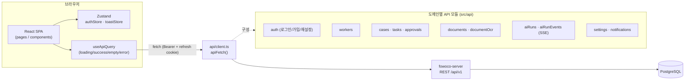
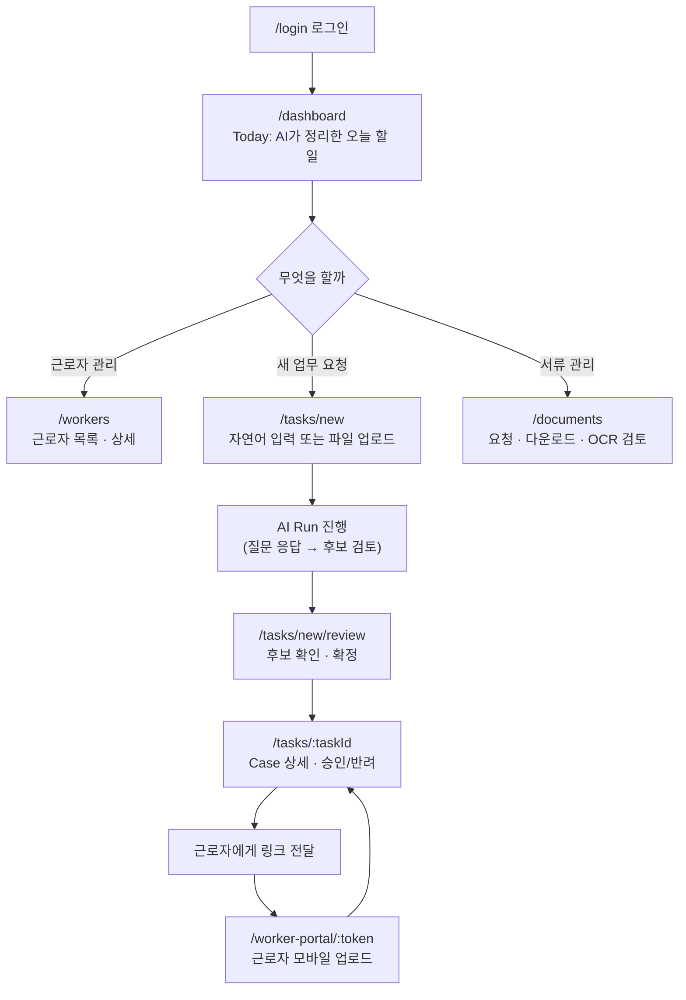
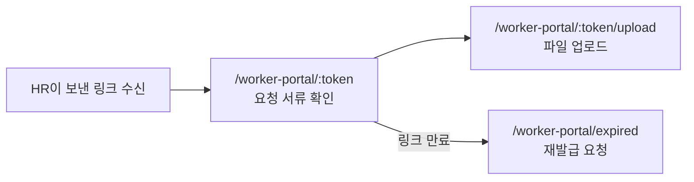

# FOWOCO Client

외국인(E-9) 근로자 채용·관리 업무를 자동화하는 HR 운영 SaaS **FOWOCO**의 프론트엔드입니다.
HR 담당자용 관리 대시보드와 근로자용 모바일 안내 화면을 하나의 React 앱으로 제공합니다.

[](https://react.dev)
[](https://www.typescriptlang.org)
[](https://vitejs.dev)
[](https://vitest.dev)

---

## 목차

- [한눈에 보기](#한눈에-보기)
- [기술 스택](#기술-스택)
- [아키텍처](#아키텍처)
- [사용자 흐름](#사용자-흐름)
- [디렉터리 구조](#디렉터리-구조)
- [시작하기](#시작하기)
- [로컬 백엔드 연결](#로컬-백엔드-연결)
- [스크립트](#스크립트)
- [문서](#문서)
- [기여](#기여)

## 한눈에 보기

|               |                                                                                                               |
| ------------- | ------------------------------------------------------------------------------------------------------------- |
| **무엇을**    | E-9 외국인 근로자의 채용 서류·비자·계약·근로 관련 업무를 HR 담당자가 한 곳에서 처리하는 웹 앱                 |
| **누가 쓰나** | 사업장 HR 담당자(관리 화면), 외국인 근로자(모바일 안내 화면, 로그인 불필요)                                   |
| **핵심 가치** | 반복적인 서류·승인 업무를 AI가 먼저 정리해서 제안하고, 담당자는 검토·승인만 하면 되는 흐름                    |
| **백엔드**    | [`fowoco-server`](https://github.com/fowoco/server) (Spring Boot, REST/JSON)                                  |
| **현재 버전** | v3.0.0 — 자세한 진행 현황은 [wiki: Project-Status](https://github.com/fowoco/client/wiki/Project-Status) 참고 |

## 기술 스택

| 영역            | 선택                                  | 비고                                                                                            |
| --------------- | ------------------------------------- | ----------------------------------------------------------------------------------------------- |
| 프레임워크      | React 19 + TypeScript (strict)        | [선택 근거](docs/FRONTEND_STACK_DECISION.md)                                                    |
| 빌드 도구       | Vite 8                                | 개발 서버 HMR, 프로덕션 빌드                                                                    |
| 라우팅          | React Router v7                       | `createBrowserRouter`, 라우트 단위 코드 스플리팅(`lazy`)                                        |
| 클라이언트 상태 | Zustand                               | 인증 세션(`authStore`), 전역 토스트(`toastStore`)                                               |
| 서버 상태       | 커스텀 `useApiQuery` 훅               | `loading/success/empty/error` 상태 모델, `@tanstack/react-query`는 설치만 되어 있고 아직 미적용 |
| 스타일          | CSS Modules + CSS 커스텀 프로퍼티     | `src/styles/tokens.css`가 색상·간격·타이포 등 디자인 토큰의 단일 소스                           |
| 테스트          | Vitest + Testing Library              | 유닛/컴포넌트 테스트, `jsdom` 환경                                                              |
| 코드 품질       | ESLint (typescript-eslint) + Prettier |                                                                                                 |
| 패키지 관리     | bun                                   | 설치·스크립트 실행 전부 bun 사용, Husky+lint-staged로 커밋 전 자동 lint/format                  |
| 배포            | Docker + Nginx                        | `Dockerfile`, `nginx.conf`                                                                      |

## 아키텍처



- **인증**: 로그인 시 access token(메모리 보관) + refresh token(HttpOnly 쿠키)을 발급받고, 새로고침 시
  `RequireAuth`가 세션을 자동 복원합니다. access token 만료는 `api/client.ts`가 401을 감지해 조용히 refresh합니다.
- **AI Run**: 자연어로 업무를 요청하면 서버가 추가 질문(`NEEDS_INFO`) → 후보 제시(`REVIEW_REQUIRED`) →
  Case/Task 생성까지 처리하고, 진행 상태는 SSE(`aiRunEvents.ts`)로 실시간 반영됩니다.
- **디자인 토큰**: 색상·라운드·그림자·모션을 CSS 변수로 관리해서 화면 전체 톤을 토큰 파일 하나로 조정할 수 있습니다.

## 사용자 흐름

### HR 담당자 (관리 화면)



### 외국인 근로자 (모바일 안내, 비로그인)



전체 화면 목록과 구현 상태는 [wiki: Screen-Catalog](https://github.com/fowoco/client/wiki/Screen-Catalog)에서 확인할 수 있습니다.

## 디렉터리 구조

```
src/
├── api/          # 도메인별 API 클라이언트 (auth, workers, cases, documents, aiRuns, ...)
├── components/   # 공통 컴포넌트 (auth, layout, ui, worker, mobile, onboarding)
├── hooks/        # useApiQuery, useDebouncedValue 등 공용 훅
├── pages/        # 라우트 단위 화면 (route당 폴더 하나)
├── store/        # Zustand 스토어 (authStore, toastStore)
├── styles/       # 디자인 토큰(tokens.css) 등 전역 스타일
├── utils/        # 순수 유틸 함수
├── view-models/  # 화면-API 매핑용 뷰모델 변환 로직
└── routes.tsx    # 라우트 정의 (RequireAuth로 보호되는 영역 / 공개 영역 구분)
```

컴포넌트별 사용법은 [wiki: Component-Library](https://github.com/fowoco/client/wiki/Component-Library)를 참고하세요.

## 시작하기

패키지 매니저로 [bun](https://bun.sh)을 사용합니다 (`npm install -g bun` 또는 [설치 가이드](https://bun.sh/docs/installation) 참고, Node 버전은 `.nvmrc` 참고).

```bash
bun install
cp .env.example .env
bun run dev
```

첫 `bun install` 시 `.husky/pre-commit` 훅이 자동 등록되어, 커밋할 때 staged 파일에 ESLint/Prettier가 자동 실행됩니다.

## 로컬 백엔드 연결

개발 서버는 `/api` 요청을 `http://127.0.0.1:8080`으로 전달합니다. 프론트에서는
`VITE_API_BASE_URL=/api/v1`을 사용해야 로그인 Refresh Cookie가 같은 출처로 유지됩니다.
백엔드 주소를 `VITE_API_BASE_URL`에 직접 넣으면 로그인 직후 요청은 성공해도 새로고침 시
세션 복원이 실패할 수 있습니다.

로컬 데모 계정 등 백엔드 실행 방법은 [wiki: Auth-and-Demo-Account](https://github.com/fowoco/client/wiki/Auth-and-Demo-Account)를 참고하세요.

## 스크립트

| 명령              | 설명                     |
| ----------------- | ------------------------ |
| `bun run dev`     | 개발 서버 실행           |
| `bun run build`   | 타입체크 + 프로덕션 빌드 |
| `bun run lint`    | ESLint 검사              |
| `bun run format`  | Prettier 포맷팅          |
| `bun run test`    | Vitest 테스트 실행       |
| `bun run preview` | 빌드 결과 로컬 프리뷰    |

## 문서

| 문서                                                                                       | 내용                                      |
| ------------------------------------------------------------------------------------------ | ----------------------------------------- |
| [`docs/FRONTEND_STACK_DECISION.md`](docs/FRONTEND_STACK_DECISION.md)                       | 프레임워크·상태관리 선택 근거             |
| [`docs/SCREEN_CATALOG.md`](docs/SCREEN_CATALOG.md)                                         | 화면 목록 (저장소 내부 버전)              |
| [`docs/EMPTY_STATE_COPY_GUIDE.md`](docs/EMPTY_STATE_COPY_GUIDE.md)                         | 빈 상태/로딩/에러 문구 가이드             |
| [Wiki: Project-Status](https://github.com/fowoco/client/wiki/Project-Status)               | 최신 진행 현황, 릴리스 이력, 알려진 갭    |
| [Wiki: Screen-Catalog](https://github.com/fowoco/client/wiki/Screen-Catalog)               | 화면별 구현 상태·Figma 대응 (최신 갱신본) |
| [Wiki: Component-Library](https://github.com/fowoco/client/wiki/Component-Library)         | 공통 컴포넌트/훅 사용법                   |
| [Wiki: Auth-and-Demo-Account](https://github.com/fowoco/client/wiki/Auth-and-Demo-Account) | 로그인 흐름과 데모 계정                   |
| [Wiki: Accessibility-Audit](https://github.com/fowoco/client/wiki/Accessibility-Audit)     | 접근성 점검 결과                          |

## 기여

브랜치·커밋·PR 규칙은 [`CONTRIBUTING.md`](CONTRIBUTING.md)를 따릅니다.
